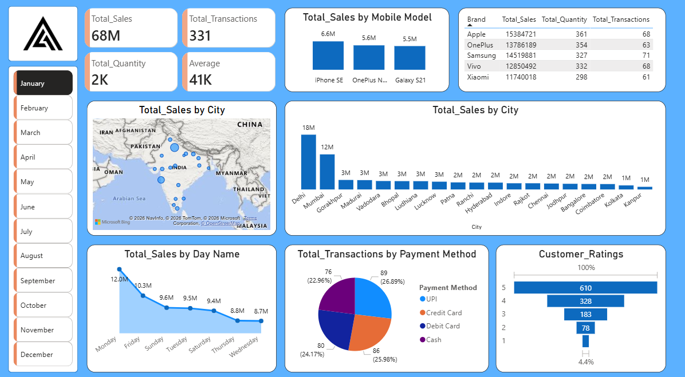

# 📊 Mobile Sales Dashboard (Power BI)

## 📌 Project Overview
This project is an interactive Mobile Sales Dashboard built using Power BI to analyze sales performance, customer behavior, and product trends.

## 🚀 Key Metrics
- Total Sales: 68M+
- Total Transactions: 331
- Total Quantity Sold: 2K+
- Average Sales Value: 41K

## 📈 Dashboard Features
- 📱 Sales by Mobile Model (iPhone, Samsung, OnePlus, etc.)
- 🌍 City-wise Sales Analysis (Map + Bar Chart)
- 📅 Sales Trends by Day
- 💳 Payment Method Analysis (UPI, Credit Card, Debit Card, Cash)
- ⭐ Customer Ratings Breakdown

## 📷 Dashboard Preview

## 🛠️ Tools Used
- Microsoft Power BI
- Data Visualization
- Data Analysis

## 💡 Key Insights
- Delhi and Mumbai are top-performing cities
- UPI is the most used payment method
- Certain models dominate sales performance

## 📂 Files Included
- Sales_Dashboard.pbix
- Sales_Dashboard.png

## 📎 How to Use
1. Download the `.pbix` file
2. Open using Power BI Desktop
3. Explore the dashboard interactively

---

⭐ If you like this project, give it a star!
